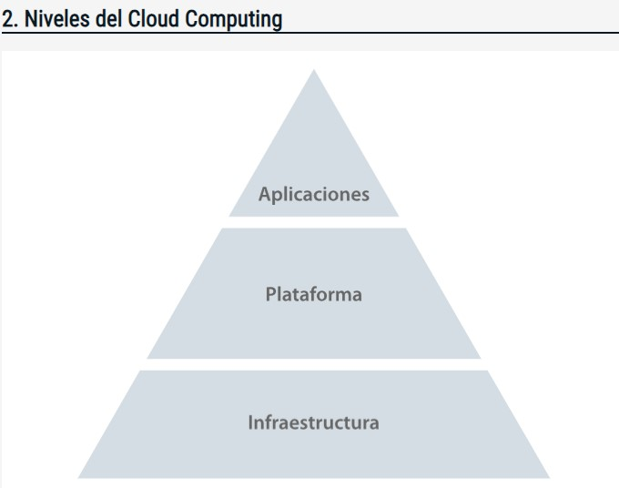
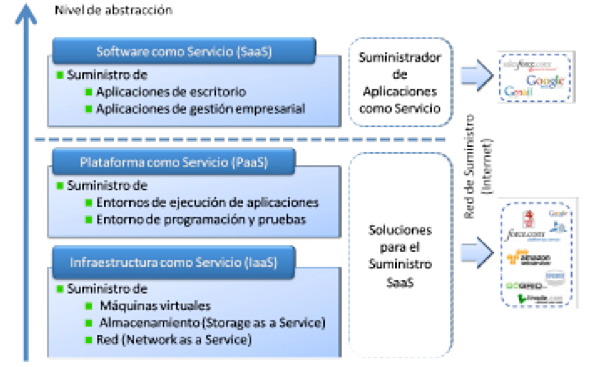

## [Niveles del Cloud Computing](2-Niveles_del_Cloud_Computing.pdf)

El **Cloud Computing tiene 3 nivelos o capas**

- IaaS ( Infraestructura as a Service ) 
Permite usar los recursos del Hardware. La infraestructura es gestionada por el 
proveedor como un servicio bajo demanda ( Servers, red, equipos, Software). 
Evita la compra de recursos por por parte de los suscriptores ya que el proveedor ofrece
recursos como objetos virtuales. El suscriptor tienegn la decisión de sistema operativo y del entorno
que instala. La gestión de la seguridad principalemnte esta a cargo del suscriptor

- PaaS (Plataforma como servicios)
Permite la creación de aplicaciones en un servicio de bajo demanda haciendo uso de un hardware y software
necesrio para ello. Se logra reducir los costes del servicio, el mantenimiento, almacenamiento y el 
control del hardware y software. El suscriptor controla de forma parcial sobre las Apps y la configuración
. La seguridad se comparte entre el proveedor y suscriptor

- SaaS (Software como servicio)
Los Sofware, Aplicaciones y recursos se diseñaron para ser ofrecidos como servicio de funcionamientod
de bajo demanda. Se reducen los costos de Software y Hardware, manteniento y operacionales.
La seguridad depende del proveedor y el suscriptor solo tiene acceso a la edición de preferencias
y a algunos previlegios administrativos de forma limitada

Las capas se relacionan una con otra. 
Para llegar a la **capa de Aplicación** la misma esta por arriba de la **Capa de plataforma** y la 
**Capa de plataforma** necesita de la **Capa de infraestructura**

{width='100px'}

En el mercado podemos encontrar estos servicios de forma separada. 

### [IaaS - Infraestructura como servicio]()
- Capacidad de provisión rápida de recursos
- Se obtiene el servicio de forma inmediata

### [Paas - Platform as a Service]()
- Apps Compartidas
- Permite construir otras Aplicaciones
- Comparten ideas en colaboración
- No es necesario instalar nada, sin versiones, licencias
- Un desarrollo y una implementación más veloz

### [SaaS - Software as a Service]()
- No es necesario de un área especializada para soportar el sistema
- Sus costos son mas bajos y su riesgo de inversión
- La empresa proveedora esta a cargo del correcto funcionamiento
- No es necesario comprar licencias, se alquila por el uso del software

#### [Aplicaciones software]()
**SaaS** representa el servicio Cloud de mayor nivel de. Los usuarios finales,
domesticos o profesionales son los clientes de este servicio. Este punto
estan en la ultima parte de la cadena de valor

#### [Plataforma de desarrollo y pruebas]()
**PaaS** (Plataform as a Service) se ofrece para el desarrollo de Aplicaciones.
proveedores de aplicaciones en modo servicio o Apps Service Provider (ASP).
Se encuentra en el punto medio de la cadena valor.
Es el encargado de proporcionar una interfaz de elevado nivel de abastracción
( APaaS)

#### [Infraestructura]()
**IaaS** (Infraestructura as a Service). Si bien se ofrece tambien para el desarrollo de aplicaciones
sus clientes principales son los **ASP** (Application Service Providers) como así tambien los usuarios
finales, domesticos o profesionales. 
Se encuentra en el comienzo y en el final de la cadena valor.

#### [Almacenamiento]()
**SaaS** (Stora as a Service) Encargado de almacenar la información en red y con un pago por su uso

#### [Máquinas Virtuales]()
Un servicio como **IaaS** (Infraestructura as a Service). Ofrece recursos virtuales con capacidad de ejecutar instancias de caractarísticas de hardware y software específicas.
Es un caso particular del Cloud Computing donde se ofrece supercomputación en modo de 
servicio mediante una acumulación de potencia en una red GRID.

#### [Red]()
**NaaS** (Network as a Service), si bien es un concepto poco utilizado representa
un servicio de red especializado ofrecidos bajo demanda o con especial integración
con otros servicios Cloud. Ej. redes privadas virtuales entre maquinas virtuales. 
Tambíen denominada **CaaS**(Communication as a Service)

### [2 Elementos que se destacaron en la oferta del Cloud]()
1. La virtualización de servidores, almacenamiento y redes.
2. El diseño de los Centro de Datos para Cloud Computing