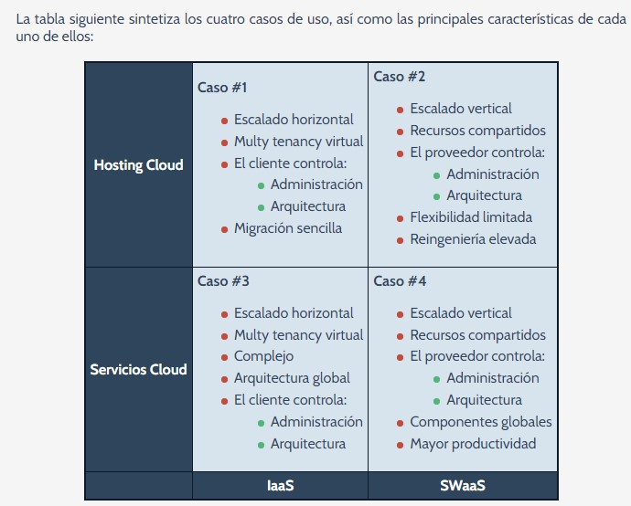

## [Casos de uso]()

Tienen un gran aporte al crecimiento económico globla, su total despegue está limitado por algunas
cuestiones regulatorias, opertaivas o de seguridad.

El porcentaje de empresas españolas que ya utilizan el servicio Cloud asciende a un % 20 de forma
completa en hacer uso de: 
* Almacenamiento
* Backups
* SaaS

Según un estudio del 2014 la cuota del mercado Cloud podría generar 28.000 millones de dólares para 
el años 2015 y se estima entre un 40 y un 50 % del total del mercado.

Hemos definido 4 casos de uso que se establecen en 2 ejes de decisión: 
* INFRAESTRUCTURA DISPONIBLE
1. El tipo de insfraestructura disponible donde se proporcionan servicios Cloud de procesamiento
    y almacenamiento
    - IaaS
    - SaaS
    - NaaS
2. Infraestructura de Aplicaciones
    - PaaS
    - APaaS
    - SWaaS

* CARACTERÍSTICAS DESEADAS
3. Alojamiento de aplicaciones. Donde solo se trasladan ciertas Apps. a sistemas de alojamiento
    Cloud Hosting.
4. Servicio Cloud. Donde se despliegan en forma de Aplicaciones Cloud, procesos de negocio
o de información en modo servicio con escalabilidad horizontal o procesamiento paralelo.

### SIGUIENTES 4 CASOS DE USO: 
## [Caso # 1 Hosting Cloud / IaaS]()
La forma mas sencilla de convivir aplicaciones y tecnologías de desarrollo en un entorno Cloud.
- Facilita el escalado horizontal
- Soporta multi organización gracias a la vitualización del hardware compartido
- El cliente controla la arquitectura y su administración pero delega al proveedor la administración
de la infraestructura compartida. Se beneficia del ahorro en el coste .
- Permite migrar de forma sencilla. El despliegue 

### [Caso # 2 Hosting Cloud / WaaS]()
Un caso para exprimir al máximo la tecnología Cloud.
- Escalado Vertical.
- Recursos Compartidos, pero no a nivel VM, sino a nivel de servicio
- El proveedor controla tanto la arquitectura, que vendrá dada por su arquitectura de servicios.
- Nivel flexible alcanzado dependiendo de la arquitectura de servicios de proveedor y del proceso
de reingenería, que impone restricciones.
- Adaptación al entorno Cloud, la reingeniería exigida puede ser muy importante

### [Caso # 3 Servicios Cloud / IaaS]()
El caso mas versatil con una cantidad de costes y responsabilidades mayor. Básicamente todo está por
encima del hipervisor y queda en manos del consumidor.
- Facilita el escalado horizontal
- Soporta multi organización mediante virtualización sobre el hardware compartido
- Mayor complejidad

Soporta arquitectura global traspasando las fronteras del negocio posibilitando las máximas
capacidades que ofrece internet y los dispositivos móviles

### [Caso # 4 Servicios Cloud / SWaaS]()
En este caso implica un compromiso entre flexibilidad y eficiencia. Desarrolla una arquitectura global
pero apoya en servicios de alto nivle ganando eficiencia con respecto al Caso # 3.
- Escalado Vertial 
- Recursos compartidos NO en Virtual Machine, sino a nivle de servicio
- El proveedor controla la arquitectura, que vendrá dada por su arquitectura de servicio
- Componentes globales, contraposición de la arquitectura global. 
- Compromiso entre eficiencia/flexibilidad.

